# Blugold

A web app for finding the cheapest fuel prices in your area. It uses a Geo visualization of the fuel stations and their prices to display the information the user is lookng for. The database is kept up to date by the users.
The main technologies used are [React](https://reactjs.org/), [Django](https://www.djangoproject.com/), [Djangorestframwork](https://www.django-rest-framework.org/), [Postgresql](https://www.postgresql.org/) and [Deck.gl](https://deck.gl/).

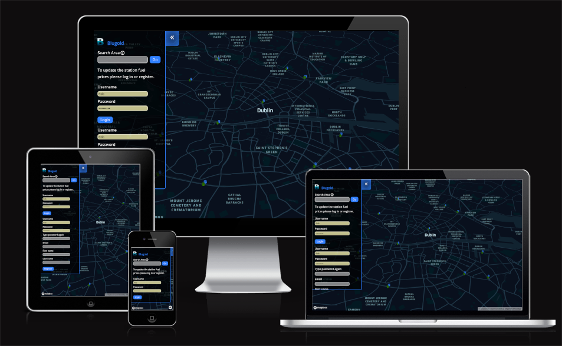

## User Experience (UX)

- ### User stories

  - #### First Time Visitor Goals

    1. As a First Time Visitor, I want to easily create an account and log in so that I can update fuel station prices.
    2. As a First Time Visitor, I want to be able to find the cheapest fuel prices in a given area without needing to login so that I know where the cheapest fuel can be bought.
    3. As a First Time Visitor, I want to be able to easily visualize fules prices on a map to find the cheapest one.

  - #### Returning Visitor Goals

    1. As a Returning Visitor, I want to be able to log in to be able to update fuel station the prices.

- ### Design
  - #### Colour Scheme
    - The main colour used throughout is blue (rgb(48, 128, 255, 255)), black (#00000080), green (#2b7400) and white (#ffffff).
  - #### Typography
    - The Open Sans font is the main font used throughout the UI with sans-serif as the fallback font in case the font isn't being imported into the site correctly. They are used because they are easy to read and have a a neutral and friendly appearance.
  - #### Imagery
    - Imagery used to make up the logo was taken from unsplash.com which was a side view of water through glass and then using GIMP a letter 'B' was imposed on the image.
  - #### Wireframe
    - This wireframe was used initially to get an idea of the style and layout of the app would be:
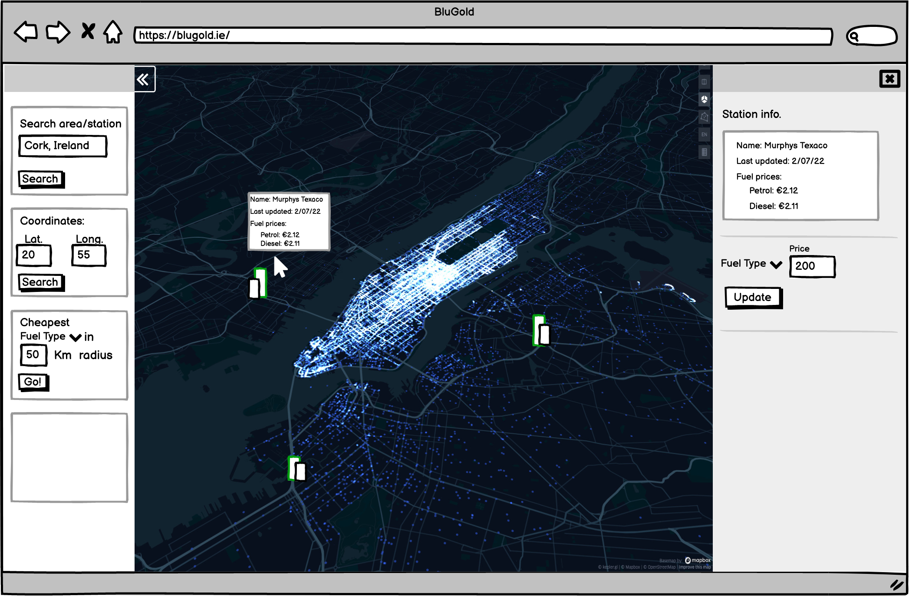

## FEATURES

### EXISTING FEATURES

- **Deckgl layered map**

- Mapbox was used for the map and Deckgl rendered the station column layers and to control the view state.

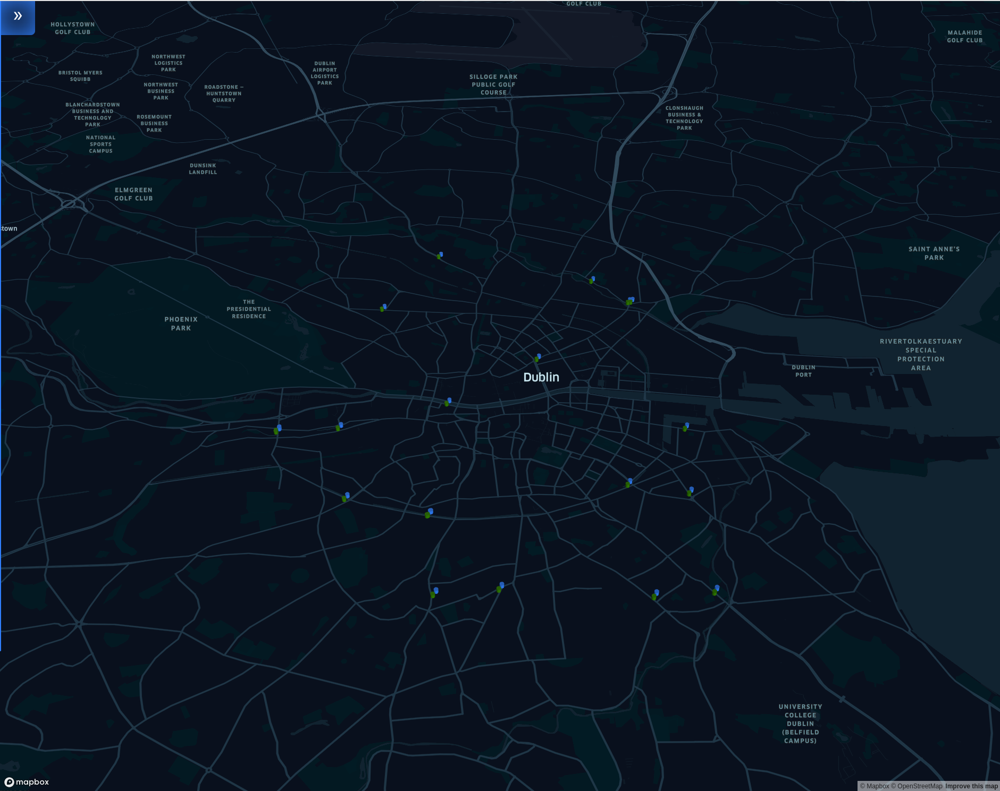

- **Expandable Sidebar UI**

- Most of the User Interface is contained in the sidebar to give as much screen space to the map as possible. It contains the login, register, logout, station update, and search interfaces.  

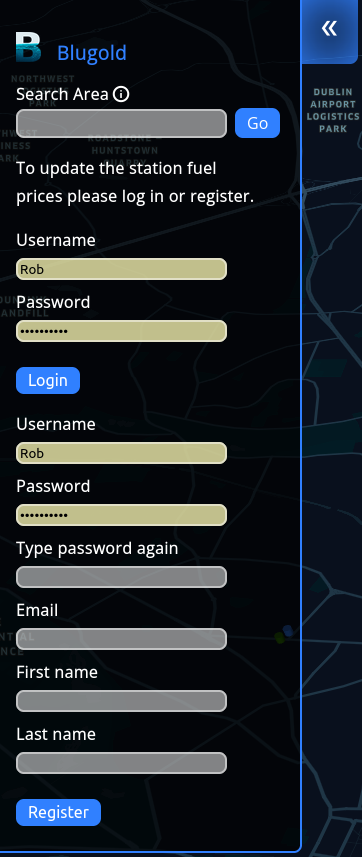

- **Search Area Input**

- The search function uses the Google Places Api to find coordinates of a given address, place name or post code and then makes another Google Places API request to find fuel stations within 3km of those coordinates. When the user makes a search deckgl will geo locate to that area of the map and close the sidebar.
There is an information icon there to explain the function with an onHover tooltip.

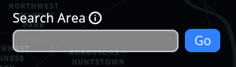

- **Login and register section**

- If the user has not logged in or the session expires the UI will display the login and register section with a message to tell the user that they will need to register and login if they want to update fuel prices. The user is automatically logged in when they are registered.

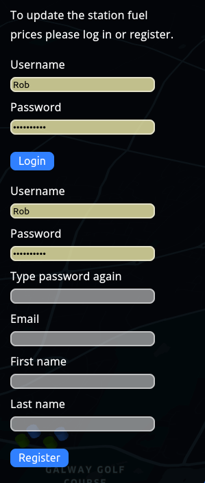

- **Username and logout section**

- Once the user is logged in the UI will display a message prompting them to click on a station on the map to view details and update. Above this is the current username logged in and a logout button.

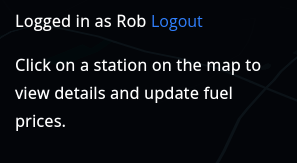

- **Update station section**

- When the user clicks on a station and they are logged in the update station section appears below the logout section in the sidebar. Here the user can update prices or delete the station price information.
This will also show the station name, address and if it is currently open according to the Google places API.

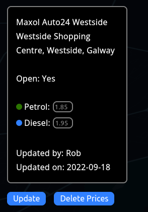

- **Map Tooltip**

- On hover over a station a tooltip will show with Station name, address, if it is open according to Google Places, the most recent fuel price, when it was updated and by who.

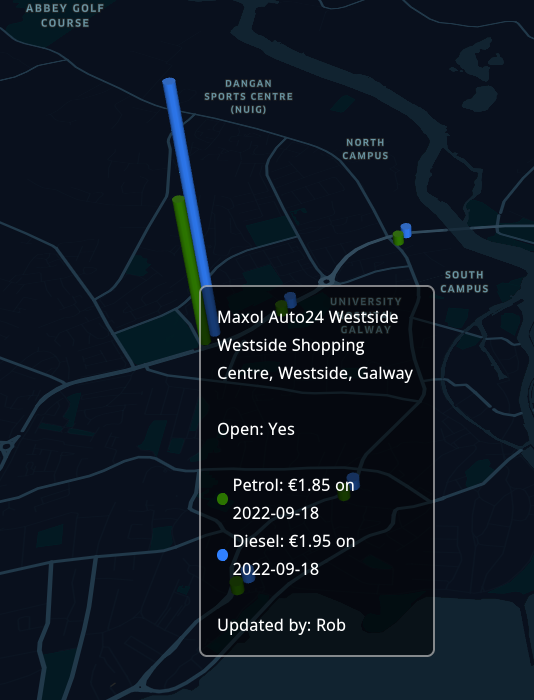

- **Modal error and warning message**

- A modal is shown when the a station is being deleted as a warning, when an email address that has already been used to register is input, when the username or password is incorrect at login, or when incorrect input is used to update a station fuel price.   

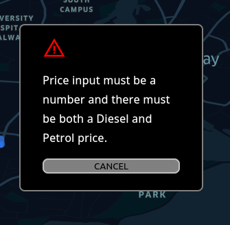
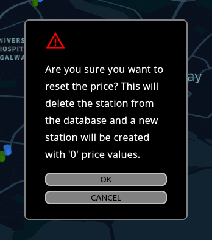

## Technologies Used

### Languages Used

- [CSS3](https://en.wikipedia.org/wiki/Cascading_Style_Sheets)
- [Javascript](https://en.wikipedia.org/wiki/JavaScript)
- [Python](https://en.wikipedia.org/wiki/Python_(programming_language))

### Frameworks, Libraries & Programs Used

1. [Google Fonts:](https://fonts.google.com/)
   - Google fonts Material symbols were used to import the 'Open Sans' font into the style.css file which is used in all text on the page. Google fonts Material symbols icons was also used for the search information icon and the drawer tab double arrow icon.
1. [Git](https://git-scm.com/)
   - Git was used for version control by utilizing the Gitpod terminal to commit to Git and Push to GitHub.
1. [GitHub:](https://github.com/)
   - GitHub is used to store the projects code after being pushed from Git.
1. [GIMP:](https://www.gimp.org/)
   - GIMP was used to create the logo from an unsplash stock image.
1. [Balsamiq:](https://balsamiq.com/)
   - Was used to create the wireframe for the UI.
1. [Django:](https://www.djangoproject.com/)
   - Django was used in the backend to serve the React frontend for the application.
1. [Django Rest Framework:](https://www.django-rest-framework.org/)
   - Django Rest Framework was used to create the Rest API to make request to the Postgresql database as well as middleware to make requests to the Google Places API and the authentication, authorization and permissions.
1. [Postgresql](https://www.postgresql.org/)
   - Postgresql was used for the fuel station price database.
1. [React:](https://reactjs.org/)
   - The React library was used to create the frontend.
1. [Deckgl:](https://deck.gl/)
   - Deckgl was used for the station column layers.
1. [Mapbox:](https://www.mapbox.com/)
   - Mapbox was used for the map geo visualisation.

### FUTURE FEATURES

- Link to Google maps directions for each station.

## TESTING

### Testing User Stories from User Experience (UX) Section

- #### First Time Visitor Goals

  1. As a First Time Visitor, I want to easily create an account and log in so that I can update fuel station prices.
     1. whe the user is not loggin in as when visiting for the first time, there is a message to explain that you need to create an accout and log in if the user wants to update fuel prices.
     2. On first visit the UI displays inputs for registration.
     3. If the registration is successful the app will automatically log you in so that you can update fuesl prices.
  2. As a First Time Visitor, I want to be able to find the cheapest fuel prices in a given area without needing to login so that I know where the cheapest fuel can be bought.
     1. At the top of the UI there there is always a search area section with an on hover information tooltip to explain its use.
     2. The search function uses Google places API to find coordinates from an address, place name, or post code and then makes a search for fuel stations within 3km of that location.
     3. The map shows two columns for each station an on hover tooltip with a legend for petrol and diesel prices for that station.

- #### Returning Visitor Goals

  1. As a Returning Visitor, I want to be able to log in to be able to update fuel station the prices.
     1. If the user is not logged in and the previous sessions is expired the user will be shown the login and register section i the UI.
     2. When the user is logged in they can now click on the fuel stations and an update station UI will be shown in the sidebar.

### Manual Testing
| Test                                                                             | Expected outcome                                                                                                                                                                                                                                                                                                                                                                                                       | Actual outcome |
|----------------------------------------------------------------------------------|------------------------------------------------------------------------------------------------------------------------------------------------------------------------------------------------------------------------------------------------------------------------------------------------------------------------------------------------------------------------------------------------------------------------|----------------|
| Check search area responds when user clicks go with correct/incorrect/no input.  | Sidebar will close upon hitting go and the map will move to the place entered and display any fuels stations that may be with 3km. An error message should be displayed if there is no or incorrect input.                                                                                                                                                                                                             | As expected    |
| Login section responds as appropriately for given input.                         | Login section will log in a registered user or give an error message. If the input is empty and login is clicked then the browser will prompt you to enter input.                                                                                                                                                                                                                                                      | As expected    |
| Register section should give appropriate feedback if incorrect input is used.    | If a username or email address has been used previously, or if the passwords do not match, or if the password is invalid an error message should be displayed to the user. If any of the fields is empty the browser should display a message to indicate that the field is required. The UI should log the user in automatically upon successful registration. Once logged in the logout section should be displayed. | As expected    |
| The lougout section should operate as expected.                                  | Logout section displays only when the user is authenticated and the session cookies are valid. Otherwise the login and registration section shows. The correct username is displayed and the logout button logs out the user displaying the login and registration section. When not logged in the user is no longer able to perform protected actions.                                                                | As expected    |

### Known Bugs

- There are no known remianing bugs.

#### Solved Bugs

- Because Django enforces CSRF protection when making an API rewuest to protected endpoints ( POST, PUT ) a 403 Forbidden error was returned even though a CsrfExemptMixin was added to the views and the correct hots added to CSRF_TRUSTED_ORIGINS in settings in the backend.
After the csrf token was added to the headers in the frontend fetch requests the these requests were then authorised.

### Further Testing

- The Website was tested on Google Chrome, Firefox, Microsoft Edge, Brave Browser, Ecosia and Safari.
- The website was viewed on a variety of devices such as Desktop, Laptop, Samsung S9, S10, iPhone X.
- Friends and family members were asked to review the site and documentation to point out any bugs and/or user experience issues.

### Validator Testing

- Python
  - I confirm that all python files were run through the pep8 online validator and all errors were corrected. Errors only consisted of E501: line too long errors.
  
- CSS
  - No errors were found when passing through the official(Jigsaw) validator.
  
- Accessibility

  - I confirm that the colours and fonts are easy to read and accessible by running it through the lighthouse in devtools.

  

## Deployment

- Local deployment during development was achieved by writing an catchall view that proxies requests for index.html to the React development server using this tutorial: [Making React and Django play well together](https://fractalideas.com/blog/making-react-and-django-play-well-together-hybrid-app-model/).
This was done to avoid having to do a build every time a change was made in the fronend during development.
The changes made to the project based on this tutorial were undone before deployment due to issues with the catchall view.

Steps for local deploy during development:
  - in the project root directory terminal enter:
    1. `sudo service postgresql start`  
    1. `source venv/bin/activate` -  to start the virtual environment.  
    1. `python manage.py runserver`  
    1. `npm start` - to run the development server for the frontendt so that the catchall view could make proxy requests to it and saved changes could be reflected immediatly.  

 

- Heroku Deployment:
  - Create a new Heroku app.
  - Set the build packs to `Python` and `NodeJS` in that order.
  - Set Config Vars key value pairs for:
    1. `ALLOWED_HOSTS`: `APP_NAME.herokuapp.com`
    1. `DATABASE_URL`: `postgres://MYSECRETLINK`
    1. `HEROKU_POSTGRESQL_ONYX_URL`: `postgres://MYSECRETLINK`
    1. `DB_PASSWORD`: `MYSECRETPASSWORD` 
    1. `DISABLE_COLLECTSTATIC`: `1`
    1. `GOOGLE_API_KEY`: `MYSECRETGOOGLEAPIKEY`
    1. `REACT_APP_MAPBOX_ACCESS_TOKEN` : `MYSECRETMAPBOXTOKEN`
    1. `SECRET_KEY`: `DJANGO_SECRET_KEY`
    1. `WEB_CONCURRENCY`: `1`

  - Enter `heroku login -i` command in the terminal with root directory of the project.
  - Enter Heroku username and password.
  - Enter `heroku git:remote -a blugold` to set the heroku remote.
  - Enter `git push heroku main` to push changes to the heroku app.

The live link can be found here - https://blugold.herokuapp.com//

## Credits

For local deployment: [Making React and Django play well together](https://fractalideas.com/blog/making-react-and-django-play-well-together-hybrid-app-model/)

This tutorial was used as a guide to set up the app initially and to get the Django backend to serve the frontend. It was also helpful as an additionl guide to deploying to Heroku: [Deploying React-Django App using Heroku](https://dev.to/mdrhmn/deploying-react-django-app-using-heroku-2gfa)

The login and registration for the app was based on this tutorial by Emre Cevik: [Login and Register User — Django Rest Framework](https://dev.to/mdrhmn/deploying-react-django-app-using-heroku-2gfa) 

For authentication with the Django Rest Framwork views and serializers were used from this tutorial from Augusto Destrero: [Django Rest Framework authentication: the easy way](https://www.guguweb.com/2022/01/23/django-rest-framework-authentication-the-easy-way/)

### Content

All icons used were form Google fonts Material Symbols [Google fonts Material Symbols](https://fonts.google.com/knowledge/glossary/material_symbols).

The image of water throught glass used to make the logo came from a free [Unsplash](https://unsplash.com) stock photo. 
